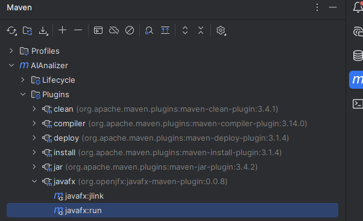

# AiAnalyzer

This is a CSC450 project that can analyze your files and leverages AI to explain your files. It will give reports of suspicious, junk, and safe files. AiAnalyzer is a Java and Spring Boot application designed to analyze and process files using AI-powered techniques. The goal is to provide insights into local files, detect patterns, and support further data-driven decisions.

### Definitions
- Active Scan: High-resource, rapid, user-initiated scan of a specific area.
- Passive Scan: Low-resource, background scan that runs when the application is idle.

Getting Started & Setup
-----------------------

Before running the application for the first time, you *must* configure your local environment. This includes setting up your Gemini API key and ensuring IntelliJ is configured to connect to the database for testing.

**>> Please follow the complete setup instructions in the [README_DATABASE.md](README_DATABASE.md) file.**


Project Structure
-----------------
### Collapsed View
<details>
<summary>Click to view the expanded project structure</summary>

```
src/main/
├── java/
│   └── edu.missouristate.aianalyzer/
│       ├── config/
│       │   └── AiClient.java
│       ├── controller/
│       ├── model/
│       │   ├── database/
│       │   └── ...
│       ├── repository/
│       │   └── ...
│       ├── service/
│       │   └── ...
│       ├── view/
│       │   └── ... 
│       ├── AiAnalyzerApplication.java
│       └── UiLauncher.java
└── resources/
    └── application.properties
```

</details>


### Expanded View
<details>
<summary>Click to view the expanded project structure</summary>

```
src/main/
├── java/
│   └── edu.missouristate.aianalyzer/
│       ├── config/
│       │   └── AiClient.java
│       ├── controller/
│       ├── model/
│       │   ├── database/
│       │   │   ├── FileRecord.java
│       │   │   ├── ImageMeta.java
│       │   │   ├── LabelHistory.java
│       │   │   └── ScanQueueItem.java
│       │   └── FileInterpretation.java
│       ├── repository/
│       │   └── database/
│       │       ├── FileRecordRepository.java
│       │       ├── ImageMetaRepository.java
│       │       ├── LabelHistoryRepository.java
│       │       └── ScanQueueItemRepository.java
│       ├── service/
│       │   ├── ai/
│       │   │   ├── AiQuery.java
│       │   │   └── ProcessFile.java
│       │   └── database/
│       │       ├── ActiveScanService.java
│       │       ├── FileProcessingService.java
│       │       ├── LabelService.java
│       │       └── PassiveScanService.java
│       ├── view/
│       │   ├── DriveView.java
│       │   ├── MetricsView.java
│       │   ├── SettingsView.java
│       │   └── SuggestionsView.java
│       ├── AiAnalyzerApplication.java
│       └── UiLauncher.java
└── resources/
    └── application.properties
```

</details>

*A Brief Explanation of Each Part:*

* [resources/application.properties](src/main/resources/application.properties): This is the configuration file for Spring Boot that controls settings for the database connection.
* [config](src/main/java/edu/missouristate/aianalyzer/config): Contains Spring Configuration beans. `AiClient` is responsible for setting up the connection to the Google AI service.
* [controller](src/main/java/edu/missouristate/aianalyzer/controller): Intended for handling web/API requests if the application were to have a web interface.
* [model](src/main/java/edu/missouristate/aianalyzer/model): Contains the data structures and JPA Entities (like `FileRecord`). These classes define the structure of our database tables.
* [repository](src/main/java/edu/missouristate/aianalyzer/repository): The data access layer. These are Spring Data JPA interfaces that provide methods for interacting with the database.
* [service](src/main/java/edu/missouristate/aianalyzer/service): Contains the core business logic, orchestrating operations like scanning files and querying the AI.
* [view](src/main/java/edu/missouristate/aianalyzer/view): Contains the JavaFX UI components and controllers for the front-end.
* [AiAnalyzerApplication.java](src/main/java/edu/missouristate/aianalyzer/AiAnalyzerApplication.java): The main entry point for the Spring Boot backend application.
* [UiLauncher.java](src/main/java/edu/missouristate/aianalyzer/UiLauncher.java): The main entry point for launching the JavaFX user interface.


Role-Based File Guide
---------------------

To help everyone find their relevant files quickly, here is a breakout by development area.

### *AI Development (more info @ [README_AI.md](README_AI.md)):*

* [AiClient.java](src/main/java/edu/missouristate/aianalyzer/config/AiClient.java): Configures and creates the connection bean for the Gemini AI service.
* [service/ai/](src/main/java/edu/missouristate/aianalyzer/service/ai/): This package contains the core logic for interacting with the AI.
    * [AiQuery.java](src/main/java/edu/missouristate/aianalyzer/service/ai/AiQuery.java): Contains the specific prompts and methods used to make calls to the Gemini API.
    * [ProcessFile.java](src/main/java/edu/missouristate/aianalyzer/service/ai/ProcessFile.java): Manages the logic for processing files (including chunking large ones) and uses `AiQuery` to get results.
* [FileInterpretation.java](src/main/java/edu/missouristate/aianalyzer/model/FileInterpretation.java): A data model that defines the types of AI searches; ACTIVE or PASSIVE.

### *Database Development (more info @ [README_DATABASE.md](README_DATABASE.md)):*

* [application.properties](src/main/resources/application.properties): Contains the SQLite database connection URL and Hibernate settings (`ddl-auto`).
* [model/database/](src/main/java/edu/missouristate/aianalyzer/model/database/): This package contains all JPA Entity classes (like `FileRecord`, `ImageMeta`). Each class here defines a table in the database schema.
* [repository/database/](src/main/java/edu/missouristate/aianalyzer/repository/database/): This package contains all Spring Data JPA interfaces (like `FileRecordRepository`). These provide the methods to perform database operations (Create, Read, Update, Delete).
* [service/database/](src/main/java/edu/missouristate/aianalyzer/service/database/): This package contains services that use the repositories to enact business logic, such as scanning the filesystem (both actively with 'ActiveScanService' and passively with 'PassiveScanService') and processing the queue ('FileProcessingService')

### *UI/Frontend Development:*

* [UiLauncher.java](src/main/java/edu/missouristate/aianalyzer/UiLauncher.java): The main entry point that starts the JavaFX application window, replacing the standard `main` method for a UI app.
* [view/](src/main/java/edu/missouristate/aianalyzer/view/): This package holds all the Java controller classes for the different screens of the application.
* [DriveView.java](src/main/java/edu/missouristate/aianalyzer/view/DriveView.java): The controller for the main screen, responsible for displaying drives and files.
* [MetricsView.java](src/main/java/edu/missouristate/aianalyzer/view/MetricsView.java): The controller for the screen that displays statistics and metrics about the file scan.
* [SettingsView.java](src/main/java/edu/missouristate/aianalyzer/view/SettingsView.java): The controller for the application's settings panel.
* [SuggestionsView.java](src/main/java/edu/missouristate/aianalyzer/view/SuggestionsView.java): The controller for the screen that shows AI-powered suggestions or insights.

How to Run
----------

- Database (see [README_DATABASE.md](README_DATABASE.md))

- UI Window (open Maven side panel on right-hand side of IntelliJ)



Requirements
------------
To ensure you can build and run this project successfully, please make sure you have the following software installed and configured.

*Prerequisites (What you need to install):*

* *Java Development Kit (JDK) 17:* This project is built on Java 17. You can download a recommended version from [Adoptium OpenJDK](https://adoptium.net/temurin/releases/?version=17).
* *Apache Maven 3.6.3+:* This is the build tool used to manage project dependencies and run the application. You can [download it here](https://maven.apache.org/download.cgi).
* *IntelliJ IDEA Lombok Plugin:* The project uses Lombok to reduce boilerplate code. You must enable the Lombok plugin in your IDE. In IntelliJ, go to *File -> Settings -> Plugins*, search for "Lombok", and install it.
* *Google AI API Key:* The application requires a Gemini API key to function. Please follow the setup instructions in [README_AI.md](README_AI.md) to create a key and configure it for the project.

*Core Project Technologies (What the project is built with):*

* *Spring Boot 3.5.5:* The core framework for the backend application, handling dependency injection and auto-configuration.
* *Spring Data JPA:* The framework used for the persistence layer, simplifying database interactions with repositories and entities.
* *JavaFX 21:* The framework used for building the graphical user interface.
* *SQLite:* The file-based SQL database engine used to store all application data.
* *Google GenAI for Java:* The official Google library used to make API calls to the Gemini model.


Contributors
------------

This project is a collaborative effort by:

| Name          | Role               | GitHub Profile                               |
|---------------|--------------------| -------------------------------------------- |
| Reese McClurg | Backend / Database | [@ReeseMcClurg](https://github.com/ReeseMcClurg) |
| Jake Schildknecht         | AI Integration     | [@jakeschild9](https://github.com/jakeschild9) |
| Josh Dejeu    | UI / Frontend      | [@JoshDejeu](https://github.com/JoshDejeu)       |

License
-------
MIT License