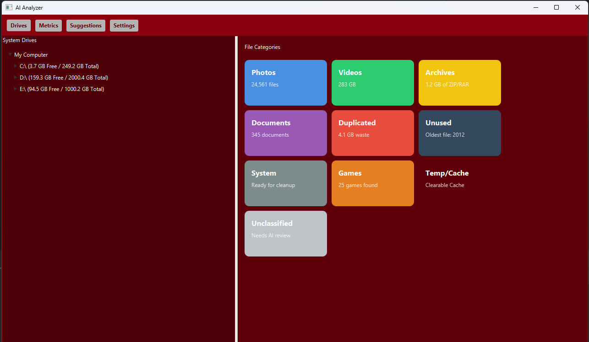
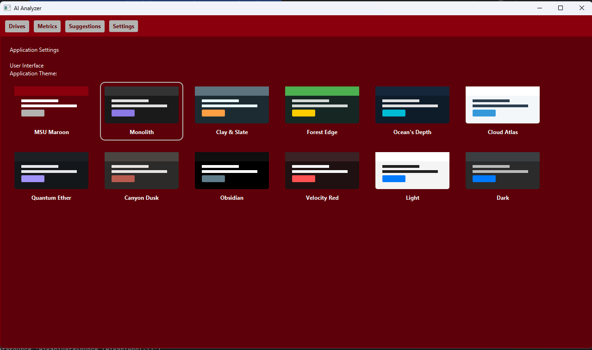
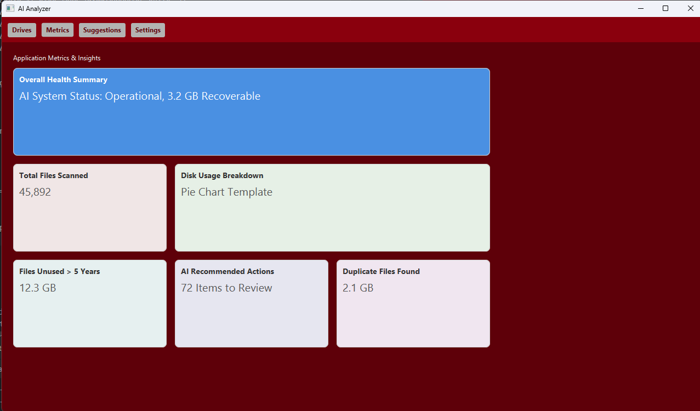
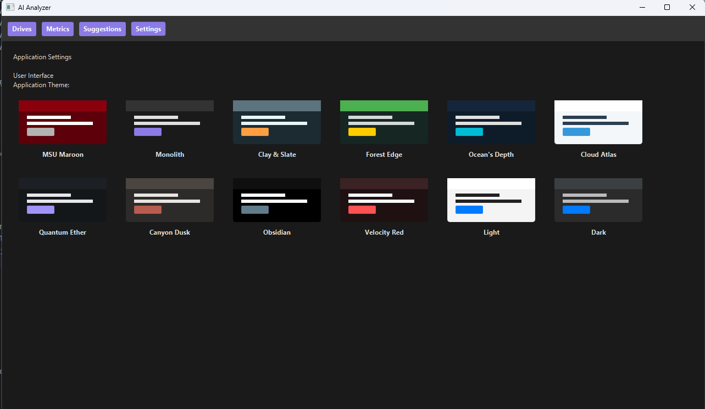
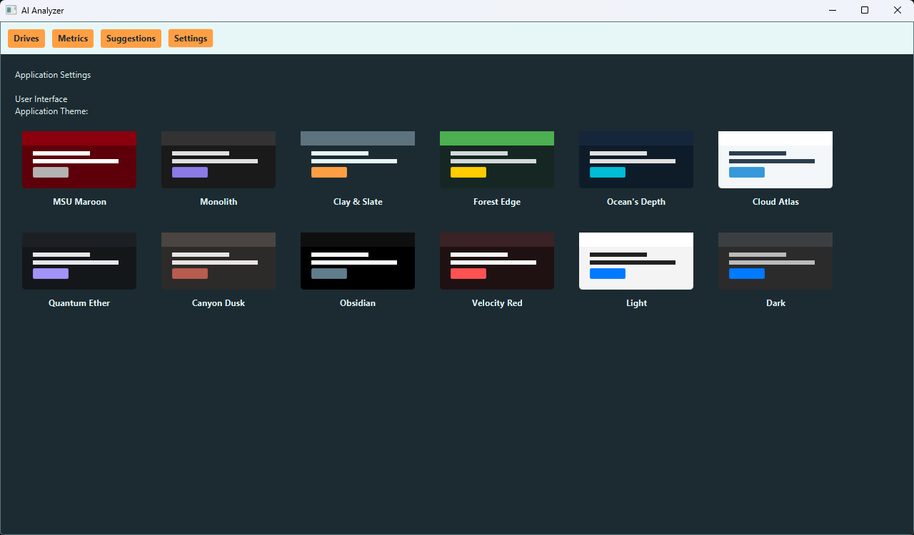
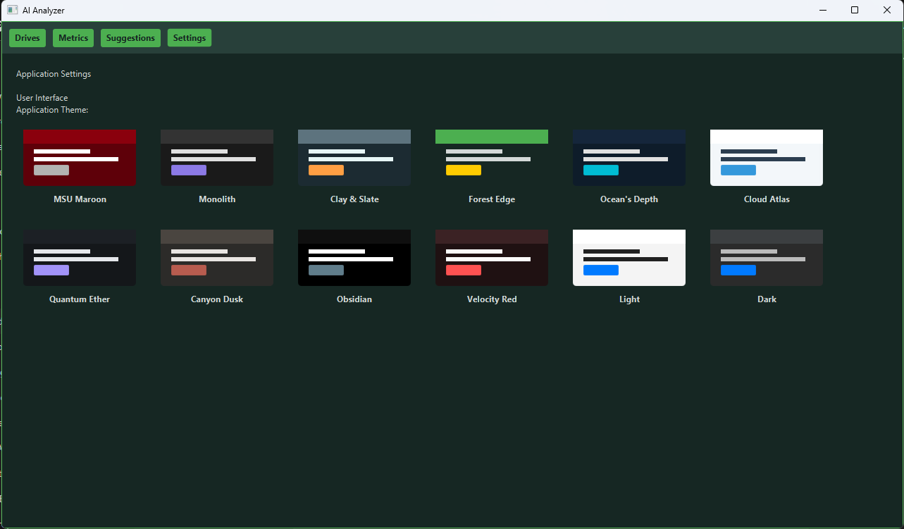
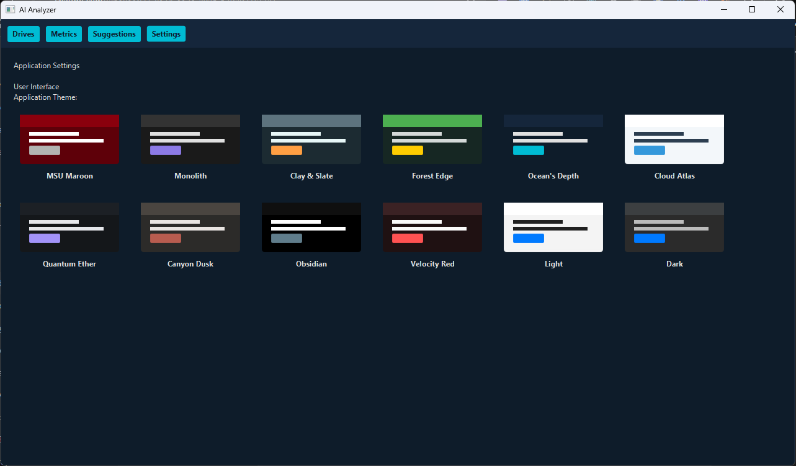
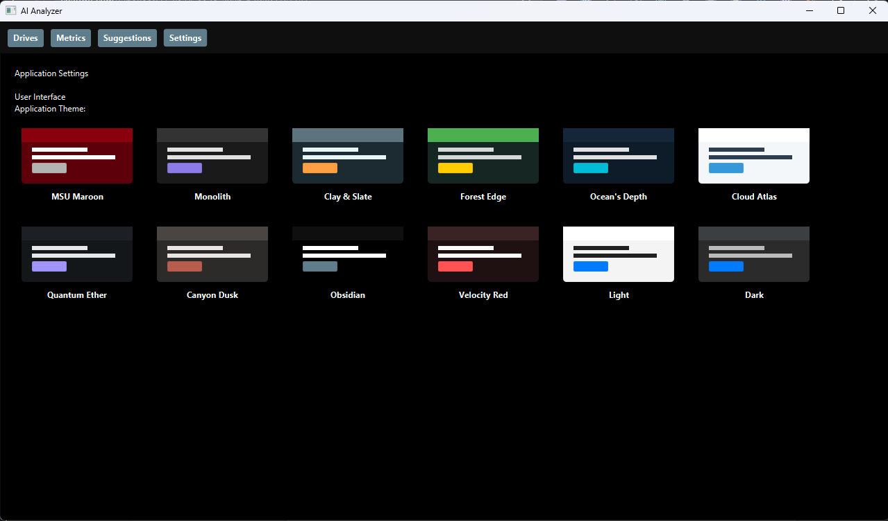
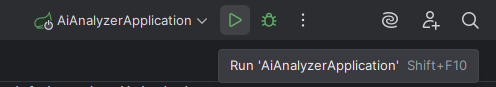

<p align="center">
  
</p>

<h1 align="center">AiAnalyzer</h1>

<p align="center">
  
  
  
  
  
</p>

<hr style="border: 0.5px solid #ccc; margin: 20px 0;">


<!-- Main large image -->
<p align="center">
  <br>
  <em>Main Dashboard Interface</em>
</p>

<!-- Two smaller images side by side -->
<p align="center">
  
  <br>
  <em>Theme Selection (left) &nbsp;&nbsp;•&nbsp;&nbsp; Metrics (right)</em>
</p>

## Themes
<table align="center">
  <tr>
    <td align="center">
      <br>
      <em>Monolith</em>
    </td>
    <td align="center">
      <br>
      <em>Clay & Slate</em>
    </td>
    <td align="center">
      <br>
      <em>Forest Edge</em>
    </td>
  </tr>
  <tr>
    <td align="center">
      <br>
      <em>Oceans Depth</em>
    </td>
    <td align="center">
      <br>
      <em>Obsidian</em>
    </td>
    <td align="center">
      <!-- empty cell to keep layout balanced -->
    </td>
  </tr>
</table>

<p align="center">
  <a href="#getting-started--setup">Getting Started</a> •
  <a href="#project-structure">Project Structure</a> •
  <a href="#technology-stack">Tech Stack</a> •
  <a href="#contributors">Contributors</a>
</p>

## Key Features
<table>
<tr><td>

- **File System Scanning:** Performs both high-speed active scans and low-impact passive monitoring.
- **AI-Powered Classification:** Uses the Gemini AI model to classify files as safe, suspicious, or junk.

</td><td>

- **Desktop GUI:** Clean, intuitive desktop interface built with JavaFX.
- **Detailed Reporting:** Provides insight into file categories, duplicates, and disk usage.

</td></tr> </table>


## Getting Started & Setup
First-time setup is required. You must configure your Gemini API key and connect IntelliJ to the database.

**>> See [README_AI.md](README_AI.md) and [README_DATABASE.md](README_DATABASE.md) for full setup instructions.**


## Project Structure
<details>
<summary>Click to view the collapsed project structure</summary>

```
src/main/
├── java/
│   └── edu/missouristate/aianalyzer/
│       ├── AiAnalyzerApplication.java    <- [Entry Point]
│       ├── config/..                     <- Holds Spring @Configuration beans for setup.
│       ├── model/..                      <- Defines data structures and database tables (@Entity classes).
│       ├── repository/..                 <- Handles database queries (e.g., find, save, delete).
│       ├── service/..                    <- Contains the core backend business logic.
│       └── ui/..                         <- Contains all frontend JavaFX code.
└── resources/..                          <- Spring Boot configuration for the database, CSS files for UI
```

</details>

<details>
<summary>Click to view the expanded project structure</summary>

```
src/main/
└── java/
    └── edu/missouristate/aianalyzer/
        ├── AiAnalyzerApplication.java           <- The main entry point; its main() method starts the entire application.
        ├── config/
        │   └── AiClient.java                    <- Sets up the connection to the Google Gemini AI service.
        ├── model/
        │   ├── database/
        │   │   ├── FileRecord.java              <- The main table; stores final metadata for a scanned file.
        │   │   ├── ImageMeta.java               <- Stores special metadata extracted only from image files.
        │   │   ├── LabelHistory.java            <- Tracks the history of AI classifications for a file over time.
        │   │   └── ScanQueueItem.java           <- A temporary task in the queue; a file waiting to be processed.
        │   └── FileInterpretation.java          <- A data class that defines the type of AI analysis to perform.
        ├── repository/
        │   └── database/
        │       ├── FileRecordRepository.java    <- Provides methods to query the files table.
        │       ├── ImageMetaRepository.java     <- Provides methods to query the image_meta table.
        │       ├── LabelHistoryRepository.java  <- Provides methods to query the label_history table.
        │       └── ScanQueueItemRepository.java <- Provides methods to query the scan_queue table.
        ├── service/
        │   ├── ai/
        │   │   ├── AiQuery.java                 <- Contains the actual text prompts that are sent to the Gemini AI.
        │   │   └── ProcessFile.java             <- Reads files (handling large ones) and uses AiQuery to get an analysis.
        │   └── database/
        │       ├── ActiveScanService.java       <- "Producer" that adds files to the queue from a user-initiated scan.
        │       ├── FileProcessingService.java   <- "Consumer" that processes items from the queue.
        │       ├── LabelService.java            <- Parses the AI's response and applies the classification label to a file.
        │       └── PassiveScanService.java      <- "Producer" that adds files to the queue by monitoring the filesystem.
        └── ui/
            ├── event/
            │   └── StageReadyEvent.java         <- A signal fired when the UI is ready to be built.
            ├── service/
            │   └── ThemeService.java            <- Handles applying and changing CSS themes.
            ├── view/
            │   ├── DriveView.java               <- The main screen for browsing drives and file categories.
            │   ├── MetricsView.java             <- The screen for displaying statistics about scanned files.
            │   ├── SettingsView.java            <- The screen for changing application settings, like the theme.
            │   └── SuggestionsView.java         <- The screen for showing AI-powered suggestions.
            ├── JavaFxApplication.java           <- The entry point for the JavaFX UI; it starts Spring and manages the UI lifecycle.
            └── StageInitializer.java            <- Builds the main application window once Spring and JavaFX are ready.
```

</details>

<div align="center">

### Role-Based File Guide

| AI Development | Database Development | UI/Frontend Development |
| :---: | :---: | :---: |
| [`service/ai`](src/main/java/edu/missouristate/aianalyzer/service/ai) | [`model/database`](src/main/java/edu/missouristate/aianalyzer/model/database) | [`ui/JavaFxApplication.java`](src/main/java/edu/missouristate/aianalyzer/ui/JavaFxApplication.java) |
| | [`repository/database`](src/main/java/edu/missouristate/aianalyzer/repository/database) | [`ui/StageInitializer.java`](src/main/java/edu/missouristate/aianalyzer/ui/StageInitializer.java) |
| | [`service/database`](src/main/java/edu/missouristate/aianalyzer/service/database) | [`ui/view/`](src/main/java/edu/missouristate/aianalyzer/ui/view) |
| | | [`ui/service/`](src/main/java/edu/missouristate/aianalyzer/ui/service) |
| **_For full details:_** | **_For full details:_** | **_For full details:_** |
| See **[README_AI.md](README_AI.md)** | See **[README_DATABASE.md](README_DATABASE.md)** | (See main README) |

</div>

## How to Run
- Database (see [README_DATABASE.md](README_DATABASE.md))
- UI Window

<p align="center">
  
</p>

- TODO: Run .exe

## Technology Stack
| Category          | Technology                                           |
| :---------------- | :--------------------------------------------------- |
| **Language** | Java 17                                            |
| **Backend** | Spring Boot 3.5.5, Spring Data JPA / Hibernate |
| **Frontend** | JavaFX 21                                          |
| **Database** | SQLite                                             |
| **Build & Tools** | Maven, Lombok                                    |
| **Services** | Google GenAI for Java                              |
<p align="center">
  
</p>

## Contributors
This project is a collaborative effort by:

| Name          | Role               | GitHub Profile                                  |
|---------------|--------------------|-------------------------------------------------|
| Reese McClurg | Backend / Database | [@ReeseMcClurg](https://github.com/ReeseMcClurg) |
| Jake Schildknecht         | AI Integration     | [@jakeschild9](https://github.com/jakeschild9)  |
| Josh Dejeu    | UI / Frontend      | [@JoshDejeu](https://github.com/JoshDejeu)      |

<p align="center">

## License

This project is licensed under the [MIT License](LICENSE).

  
</p>